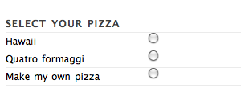

===============
Markup patterns
===============

What is a markup pattern?
=========================

NuPlone[r] makes extensive use of markup patterns. Markup patterns are methods
to associate *behaviour* with *markup*, without having to write page-specific
javascript. 

Lets consider a simple example: suppose you have pizza order form. You want to
allow users to choose their own toppings, but only if they select custom
pizza type. The topping selections should not be visible when a user selects
one of the standard pizzas. The markup for that will look something like this:

.. code-block:: html

   <fieldset class="concise">
     <legend>Select your pizza</legend>
     <label><input type="radio" name="type" value="hawaii"/> Hawaii</label>
     <label><input type="radio" name="type" value="4cheese"/> Quattro formaggi</label>
     <label><input type="radio" name="type" value="custom"/> Make my own pizza</label>
     <fieldset class="comprehensive checkList dependsOn-type-equals-custom">
       <legend>Select your toppings</legend>
       <label><input type="checkbox" name="topping" value="pepperoni"/> Pepperoni</label>
       <label><input type="checkbox" name="topping" value="onions"/> Onions</label>
       <label><input type="checkbox" name="topping" value="mushrooms"/> Mushrooms</label>
     </fieldset>
   </fieldset>
     

When the user first views this form he will only see the radio buttons to
select the type of pizza:

As soon as the user selects *Make my own pizza* the topping options appear:

.. image:: pizza-other.png

This happens without having to write a single line of javascript!

Contents
========
.. toctree::
  :maxdepth: 2

  markup
  javascript

